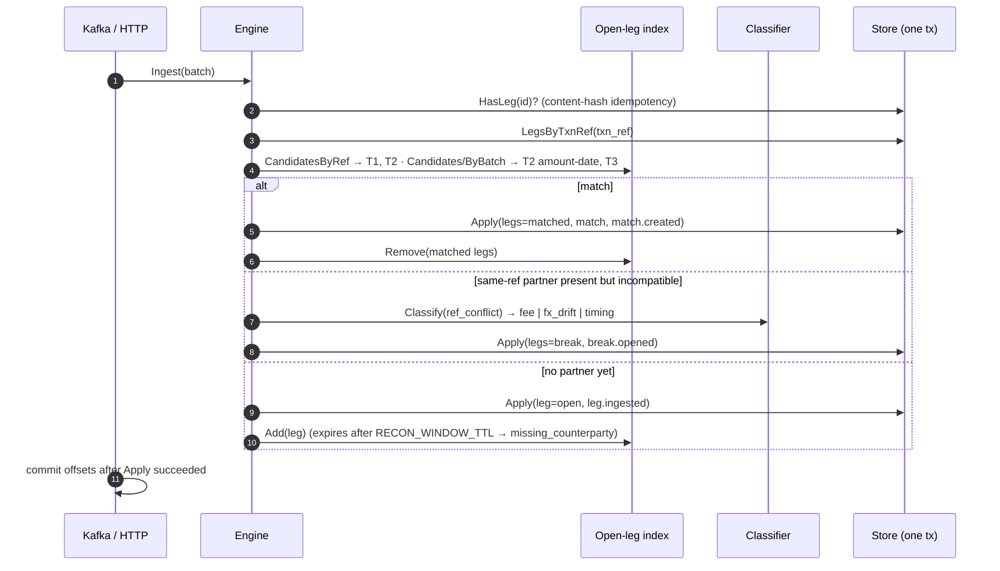

# recon-stream

> Streaming reconciliation engine for ledgers, payment rails and card processors: deterministic tiered matching, classified breaks, event-sourced replay.

[](https://go.dev/dl/)
[](LICENSE)
[](https://github.com/udaykishore-resu/recon-stream/actions/workflows/ci.yaml)

## Problem

Every bank, acquirer and payments company reconciles the same money three or
four times: the core ledger says a customer was charged, the card network's
settlement file says what was actually paid, the payment rail says when it
landed. Those views are produced by different systems, on different clocks, with
different identifiers, and they disagree constantly, by interchange fees, FX
rounding, T+1 versus T+2 value dates, duplicated files and transactions that one
side simply never saw.

The industry answer has been end-of-day batch reconciliation: pull yesterday's
files, run a matching job, hand a spreadsheet of "breaks" to an operations team
in the morning. It has resisted modernisation because the hard part is not the
matching, it is the trust: a false match hides a real loss, a lost record
double-counts a settlement, and an unexplained "auto-match 97%" is useless to an
auditor. Vendors bolt machine learning onto the matching step and make the
problem worse, because the decision becomes unexplainable.

recon-stream treats reconciliation as a streaming problem with an audit trail:
legs are matched the moment their counterpart arrives, every match carries the
rule and version that produced it, every unmatched leg becomes a classified,
ageing break, and the whole state can be rebuilt from an append-only event log.

## Approach

- **Deterministic core.** Matching runs ordered tiers, first hit wins:
  `T1.exact` (ref + amount + currency), `T2.ref-tolerant` (bps/absolute
  tolerance, ±N value days), `T2.amount-date` (ref-less, unique both sides),
  `T3.subset-sum` (one settlement leg vs N legs, bounded search, batch-hinted).
  Same inputs, same output, every run; all candidate iteration is sorted.
- **Auditable by construction.** Every `Match` stores `rule_id@version`; every
  `Break` stores `classifier_id@version` plus a one-line evidence string. IDs
  are content hashes, so a replay reproduces byte-identical results.
- **ML confined to labelling.** The `BreakClassifier` interface only labels and
  scores breaks (fee, fx_drift, timing, duplicate, missing_counterparty). It can
  never turn a break into a match. The shipped `heuristic@v1` is deterministic
  and explainable; a learned model drops in behind the same interface.
- **At-least-once, idempotent.** Kafka offsets commit after state is durable.
  A leg's identity is `source:txn_ref:sha256(content)`, so redelivery is a
  no-op and a same-ref-different-content record becomes a `duplicate` break.
- **Event-sourced.** `recon_events` is the source of truth; `legs`, `matches`
  and `breaks` are projections rebuilt by `POST /v1/replay?from=`.
- **Zero-infra local run.** In-memory adapters make `make run` and the tests
  work without Kafka or Postgres; the real adapters use franz-go and pgx.

## Architecture

```mermaid
flowchart LR
    subgraph Sources
        L[Core ledger]
        R[Card network / rail]
        O[Ops tooling]
    end
    subgraph Kafka
        T1[(ledger.legs)]
        T2[(rail.legs)]
    end
    subgraph recon-stream
        K[Kafka consumer<br/>manual commits]
        H[HTTP API]
        E[Matching engine<br/>T1 / T2 / T3<br/>windowed open-leg index]
        C[BreakClassifier<br/>heuristic@v1]
        S[ports.Store]
    end
    P[(Postgres<br/>legs · matches · breaks<br/>recon_events)]
    M[(in-memory)]
    PR[Prometheus]
    OT[OTel collector]
    L --> T1 --> K --> E
    R --> T2 --> K
    O --> H --> E
    E --> C
    E --> S --> P
    S --> M
    H -.->|/metrics| PR
    H -.->|OTLP| OT
```

Hot path for one incoming leg:



Full diagrams and package map: [docs/architecture.md](docs/architecture.md).

## Quick start

Requires Go 1.26+, `curl` and `python3` (for the demo script's JSON formatting).

```sh
make run          # in-memory store, listens on :8080
```

In another terminal, load the 200-leg sample (`examples/legs.json`: 105 ledger
postings vs 95 Visa/Mastercard settlement records, including netted interchange,
an EUR settlement of a USD posting, a settlement six days late, a re-sent
record and two postings the network never saw):

```sh
curl -s -X POST localhost:8080/v1/legs -H 'Content-Type: application/json' \
  --data-binary @examples/legs.json | python3 -c 'import json,sys; d=json.load(sys.stdin); print({k:d[k] for k in ("accepted","matched","breaks","open","duplicates")})'
# {'accepted': 200, 'matched': 91, 'breaks': 4, 'open': 105, 'duplicates': 0}
```

Close the window (EOD cut-off), then read the numbers:

```sh
curl -s -X POST localhost:8080/v1/windows/close
# {"expired":2,"older_than":"0s"}

curl -s localhost:8080/v1/stats | python3 -c 'import json,sys; s=json.load(sys.stdin)["stats"]; print("auto_match_rate=%.1f%%" % (100*s["auto_match_rate"]), s["matches_by_rule"], s["breaks_open_by_category"])'
# auto_match_rate=95.5% {'T1.exact@v1': 76, 'T2.amount-date@v1': 2, 'T2.ref-tolerant@v1': 9, 'T3.subset-sum@v1': 4} {'duplicate': 1, 'fee': 1, 'fx_drift': 1, 'missing_counterparty': 2, 'timing': 1}
```

List the fee break, resolve it with an audited reason, and replay the log:

```sh
curl -s 'localhost:8080/v1/breaks?status=open&category=fee'
# {"breaks":[{"id":"brk_4f6a83e274ec59a5658c","leg_ids":[...],"category":"fee","confidence":0.95,
#   "classifier_id":"heuristic@v1","trigger":"ref_conflict","status":"open",
#   "reason":"fee attribute \"interchange_minor\" present; amount difference 3820", ...}],"count":1,...}

curl -s -X POST localhost:8080/v1/breaks/brk_4f6a83e274ec59a5658c/resolve \
  -H 'Content-Type: application/json' \
  -d '{"reason":"interchange netted by scheme; booked to 4210","actor":"ops@example.bank"}'
# {"id":"brk_4f6a83e274ec59a5658c","status":"resolved","actor":"ops@example.bank","resolved_at":"...", ...}

curl -s -X POST 'localhost:8080/v1/replay?from=1'
# {"from_seq":1,"through_seq":301,"events_read":301,"legs_replayed":200,"matched":91,"breaks":4,"open":105}
```

`./examples/demo.sh` runs all of the above (plus a T3 match inspection and the
audit event) and fails if the auto-match rate drops below 95%.
`make run-full` starts Kafka (KRaft), Postgres and an OTel collector with
docker compose and runs the service against them; legs published to
`ledger.legs` / `rail.legs` flow through the same engine.

## HTTP API

| Method | Path | Purpose |
| --- | --- | --- |
| `POST` | `/v1/legs` | Batch ingest (`{"legs":[...]}` or a bare array, ≤ 5000) |
| `GET` | `/v1/legs/{id}` | Leg by ID |
| `GET` | `/v1/breaks` | Filter by `status`, `category`, `currency`, `counterparty`, `min_age`, page with `limit`/`offset` |
| `GET` | `/v1/breaks/{id}` | Break with its legs |
| `POST` | `/v1/breaks/{id}/resolve` | `{"reason","actor"}` → `break.resolved` audit event; 409 if already resolved |
| `GET` | `/v1/matches/{id}` | Match with its legs |
| `GET` | `/v1/stats` | Totals, auto-match rate, by rule / by category, active rules |
| `GET` | `/v1/events` | Read the event log (`from`, `limit`) |
| `POST` | `/v1/replay?from=` | Rebuild projections from the event log |
| `POST` | `/v1/windows/close?older_than=` | Force-expire open legs (EOD cut-off) |
| `GET` | `/healthz`, `/readyz`, `/metrics` | Liveness, readiness (store + source ping), Prometheus |

Spec: [api/openapi.yaml](api/openapi.yaml).

## Configuration

All settings are environment variables. Secrets (the Postgres DSN) come from
the environment or an external Secret; nothing is read from files.

| Variable | Default | Description |
| --- | --- | --- |
| `RECON_HTTP_ADDR` | `:8080` | HTTP listen address |
| `RECON_LOG_LEVEL` | `info` | `debug` / `info` / `warn` / `error` (JSON to stdout) |
| `RECON_SERVICE_NAME` | `recon-stream` | OTel service name |
| `RECON_SHUTDOWN_TIMEOUT` | `20s` | Drain timeout on SIGTERM |
| `RECON_STORE` | `memory` | `memory` or `postgres` |
| `RECON_POSTGRES_DSN` | | Required when `RECON_STORE=postgres`; migrations run at start |
| `RECON_KAFKA_ENABLED` | `false` | Start the consumer group |
| `RECON_KAFKA_BROKERS` | `localhost:9092` | Comma-separated seed brokers |
| `RECON_KAFKA_GROUP` | `recon-stream` | Consumer group |
| `RECON_KAFKA_TOPICS` | `ledger.legs,rail.legs` | Topics; `<prefix>.legs` supplies a default `source` |
| `RECON_WINDOW_TTL` | `48h` | How long an unmatched leg waits before becoming a break |
| `RECON_SWEEP_INTERVAL` | `30s` | Expiry sweep cadence |
| `RECON_TOLERANCE_BPS` | `10` | Relative amount tolerance (basis points) |
| `RECON_TOLERANCE_ABS_MINOR` | `2` | Absolute tolerance floor (minor units) |
| `RECON_VALUE_DATE_WINDOW_DAYS` | `2` | ±N value days |
| `RECON_T3_MAX_CANDIDATES` | `24` | Cap on legs considered by the T3 subset sum (2..64) |
| `RECON_T3_MAX_SUBSET` | `6` | Max legs on the "many" side (2..12) |
| `RECON_T3_REQUIRE_BATCH_HINT` | `true` | T3 only across legs sharing `attrs.batch_ref`; `false` allows unhinted sums |
| `RECON_OTEL_ENDPOINT` | | OTLP/HTTP traces endpoint (`host:4318`); empty disables export |
| `RECON_OTEL_INSECURE` | `true` | Plain HTTP to the collector |

Leg schema (`attrs` are free-form strings; `batch_ref` drives T3, `fee_minor`
/ `interchange_minor` / `fx_rate` / `original_currency` inform the classifier):

```json
{"source":"card_network","txn_ref":"TXN-240001","amount_minor":38002,"currency":"GBP",
 "value_date":"2026-09-16","direction":"credit","counterparty":"MASTERCARD",
 "attrs":{"arn":"7451...","settlement_file":"MASTERCARD-STL-20260916-01"}}
```

## Operations

- **SLOs**: ingest availability 99.9%, p99 ingest < 250 ms per 1 000-leg batch,
  consumer lag < 60 s, auto-match rate ≥ 95%, no open break older than two
  business days.
- **Metrics** (Prometheus, `/metrics`): `recon_http_requests_total`,
  `recon_http_request_duration_seconds`, `recon_ingest_batch_duration_seconds`,
  `recon_legs_ingested_total{source,outcome}`, `recon_matches_total{tier,rule}`,
  `recon_match_residual_minor{tier}`, `recon_breaks_opened_total{category,trigger}`,
  `recon_open_legs`, `recon_kafka_commits_total{result}`, plus Go/process collectors.
- **Traces**: OpenTelemetry server spans per request with W3C propagation;
  `slog` JSON logs carry `request_id`, `trace_id`, `span_id`.
- **Dashboards**: reconciliation overview (match rate, rule mix, break mix,
  break age) and service health (RED, lag, commits, runtime).
- **Scaling model**: one engine is a single writer over its windows; scale by
  keying Kafka on `counterparty|currency` and running one replica per partition
  group. The Helm chart ships a PDB, optional HPA and ServiceMonitor, a
  default-deny NetworkPolicy and a read-only non-root container.
- **Runbook**: [docs/runbook.md](docs/runbook.md) (alerts, common failures,
  replay and rollback procedures).

Measured on one core with the in-memory store: ~70 000 legs/s end to end
(`go test -bench BenchmarkIngestPairs ./internal/domain/recon/`).

## Design decisions

- [ADR 0001: Single-writer engine with event-sourced projections](docs/adr/0001-single-writer-engine-with-event-sourced-projections.md)
- [ADR 0002: Deterministic, versioned, ordered matching tiers](docs/adr/0002-deterministic-tiered-matching-rules.md)
- [ADR 0003: At-least-once ingest, content-hash idempotency and window expiry](docs/adr/0003-at-least-once-ingest-with-content-hash-idempotency.md)
- [ADR 0004: Heuristic break classifier behind a pluggable interface](docs/adr/0004-heuristic-break-classifier-behind-an-interface.md)

## Repository layout

```
cmd/recon-stream/          wiring: config → adapters → engine → http/kafka → run
internal/domain/recon/     legs, matches, breaks, rules, index, matcher, engine (no I/O)
internal/domain/classify/  heuristic@v1 BreakClassifier
internal/ports/            Store and LegSource interfaces
internal/adapters/         memory, postgres (pgx), kafka (franz-go)
internal/api/http/         handlers + middleware
internal/observability/    slog, OTel, Prometheus
migrations/                embedded SQL migrations
api/openapi.yaml           OpenAPI 3.1
deploy/helm/recon-stream   chart; deploy/docker-compose.yaml local full stack
docs/                      architecture, runbook, ADRs
examples/                  200-leg sample, generator, demo script
```

## Roadmap

- Postgres integration tests against a real database in CI (the adapter is
  exercised only by compilation today).
- Multi-ref matching: alternate identifiers in `attrs` (ARN, RRN, end-to-end ID)
  as additional T1/T2 keys.
- Break workflow: assignment, comments and SLA timers on top of the audit events.
- A learned classifier (`model@v1`) trained on resolved-break history, kept
  behind the heuristic as a low-confidence fallback.
- Snapshotting of the event log for faster replay of very long histories.

Topics: go, kubernetes, kafka, postgresql, reconciliation, payments, fintech, event-sourcing, stream-processing, opentelemetry, prometheus, helm

## Skills demonstrated

- Platform engineering in Go: ports-and-adapters layout, single-writer domain
  engine, graceful shutdown, no goroutine leaks under `-race`.
- Event-driven design: at-least-once Kafka consumption with manual commits,
  content-hash idempotency, event-sourced projections with deterministic replay.
- Financial-domain modelling: minor-unit amounts, ISO currencies, value-date
  windows, tolerance in basis points, many-to-one settlement matching.
- Auditable decisioning: versioned rules, classifier evidence, append-only
  audit events for operator actions.
- Testing: table-driven engine tests, property and fuzz tests for the bounded
  subset-sum, golden replay-determinism test, HTTP integration tests, benchmarks.
- Operability: RED and domain metrics, OpenTelemetry tracing, structured logs,
  runbook with alert expressions, Helm chart with security context, PDB, HPA,
  NetworkPolicy and ServiceMonitor.

## License

Apache-2.0. Copyright 2026 Udaykishore Resu.
